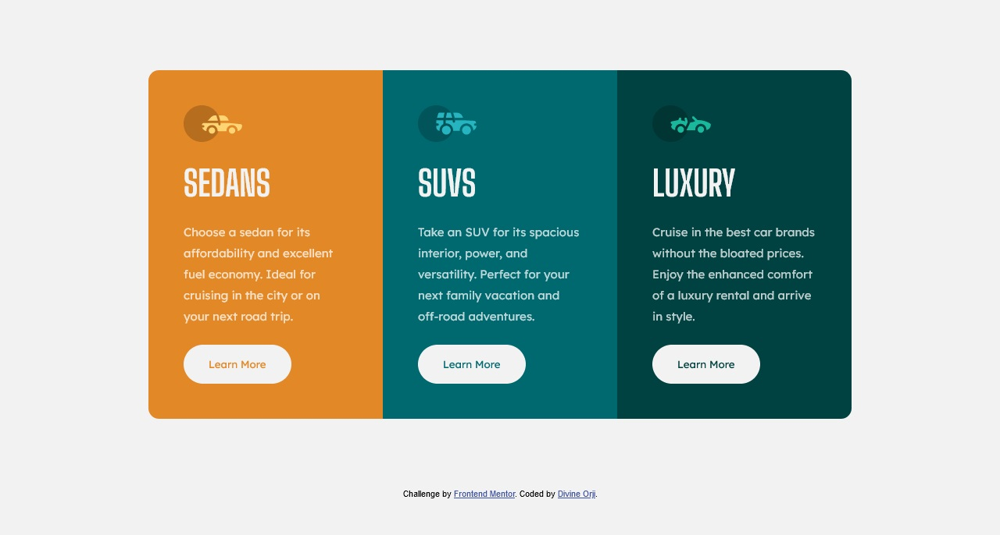

# Frontend Mentor - 3-column preview card component solution

This is a solution to the [3-column preview card component challenge on Frontend Mentor](https://www.frontendmentor.io/challenges/3column-preview-card-component-pH92eAR2-). Frontend Mentor challenges help you improve your coding skills by building realistic projects.

## Table of contents

- [Frontend Mentor - 3-column preview card component solution](#frontend-mentor---3-column-preview-card-component-solution)
  - [Table of contents](#table-of-contents)
  - [Overview](#overview)
    - [The challenge](#the-challenge)
    - [Screenshot](#screenshot)
    - [Links](#links)
  - [My process](#my-process)
    - [Built with](#built-with)
    - [What I learned](#what-i-learned)
    - [Continued development](#continued-development)
    - [Useful resources](#useful-resources)
  - [Author](#author)
  - [Acknowledgments](#acknowledgments)

## Overview

### The challenge

Users should be able to:

- View the optimal layout depending on their device's screen size
- See hover states for interactive elements

### Screenshot

### Links

- Solution URL: [My Solution](https://your-solution-url.com)
- Live Site URL: [Click Me to view](https://dpkreativ.github.io/3-column-preview-card-component/)

## My process

### Built with

- Semantic HTML5 markup
- CSS custom properties
- CSS Grid
- Mobile-first workflow

### What I learned

I re-inforced my knowledge and use of semantic HTML5, and I also practiced more on writing good comments and commit messages (two different things)

### Continued development

I'm going to keep practicing on writing good HTML5 code and structuring properly, until I can write code that does not have any HTML issues.

### Useful resources

- [HTML elements reference](https://developer.mozilla.org/en-US/docs/Web/HTML/Element) - This page lists all HTML5 tags and their uses. This helped me figure out how to structure my project's HTML.

## Author

- Website - [Divine Orji](https://dpkreativ.vercel.app)
- Frontend Mentor - [@dpkreativ](https://www.frontendmentor.io/profile/dpkreativ)
- Twitter - [@dpkreativ](https://www.twitter.com/dpkreativ)

## Acknowledgments

Thanks to the amazing community at frontendmentor.io for giving timely and detailed feedback on my challenge submission.
